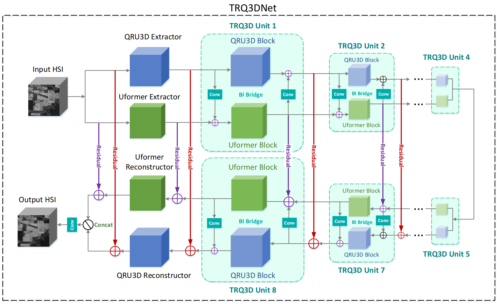

# TRQ3DNet

The implementation of paper ["TRQ3DNet: A 3D Quasi-Recurrent and Transformer
Based Network for Hyperspectral Image Denoising"](https://doi.org/10.3390/rs1010000)



## Introduction

We propose a new deep neural network termed TRQ3DNet which combines convolutional neural network (CNN) and transformer for hyperspectral image (HSI) denoising. The network consists of two branches. One is built by 3D quasi-recurrent blocks, including convolution and quasi-recurrent pooling operation. Specifically, the 3D convolution can extract the spatial correlation within a band, and spectral correlation between different bands, while the quasi-recurrent pooling operation is able to exploit global correlation along the spectrum. The other branch is composed of a series of Uformer blocks. The Uformer block uses window-based multi-head self-attention (W-MSA) mechanism and the locally enhanced feed forward network (LeFF) to exploit the global and local spatial features. To fuse the features extracted by the two branches, we develop a bidirectional integration bridge (BI bridge) for better preserving the image feature information. Experimental results on synthetic and real HSI data show the superiority of our proposed network. For example, in the case of Gaussian noise with sigma 70, the PSNR value of our method significantly increases about 0.8 compared with other state-of-the-art methods.

## Highlights

* We compare our model with other methods in Gaussian and complex denoising cases on the ICVL dataset. The results show that our
 model out-performs other state-of-art methods in all complex cases.

<div align=center>


</div>

* We also evaluate our model on two real HSI datasets, i.e., Indian Pines and Urban. We show some visulization
 comparison results, from which it can be seen that our model achieves better performance than other methods.

<div align=center>


</div>

## Getting Started

### 1. Preparing your training/testing datasets
Here, we give an example for single scale data preparation of ICVL.

Firstly, download ICVL hyperspectral images into ```data/ICVL/filefolder``` folder and 
make sure your initial data are in the following structure. The train-validation-test 
split can be found in ```train_fns.txt``` , ```validation_fns_*.txt``` and 
```test_fns_*.txt```. (Note we split the 101 testing data into two parts for Gaussian 
and complex denoising respectively.) You can create the split by yourself or by the function 
```creat_train_val_test``` in ```hsi_data.py```.


```angular2html
data/ICVL
├── filefolder
│    └──ICVL images (*.mat)
├── train_fns.txt
├── validation_fns_gauss.txt
├── validation_fns_complex.txt
├── test_fns_gauss.txt
├── test_fns_complex.txt
```

Modify and run the python code ```hsi_data.py``` to split the data and create training set. 
Then you will get data in the following structure

```angular2html
data/ICVL
├── filefolder
│    ├──ICVL images (*.mat)
│    ├── trainset
│    │    └──*.mat
│    ├── valset_gauss
│    │    └──*.mat
│    ├── valset_complex
│    │    └──*.mat
│    ├── testset_gauss
│    │    └──*.mat
│    └── testset_complex
│         └──*.mat
├── trainset
│    └──ICVL64_31.npz
```

Modify and run the matlab code ```matlab/HSIValData.m``` and ```matlab/HSITestData.m``` to create validation and testing sets.
Then you will get data in the following structure

```angular2html
data/ICVL
├── filefolder
├── trainset
│    └──ICVL64_31.npz
├── valset_gauss
│    └──ICVL_512_30
│        └──*.mat
│    └──ICVL_512_50
│        └──*.mat
├── valset_complex
│    └──ICVL_512_noniid
│        └──*.mat
│    └──ICVL_512_complex
│        └──*.mat
├── testset_gauss
│    └──ICVL_512_30
│        └──*.mat
│    └──ICVL_512_50
│        └──*.mat
│    └──ICVL_512_70
│        └──*.mat
│    └──ICVL_512_blind
│        └──*.mat
├── testset_complex
│    └──ICVL_512_noniid
│        └──*.mat
│    └──ICVL_512_stripe
│        └──*.mat
│    └──ICVL_512_deadline
│        └──*.mat
│    └──ICVL_512_impulse
│        └──*.mat
│    └──ICVL_512_mixture
│        └──*.mat
```


### 2. Testing with pretrained models
Read and modify ```basefolder``` and ```savedir``` in ```hsi_test.py```.

* [Blind Gaussian noise removal]:   
```python hsi_test.py -a trq3d -p gauss -r -rp ./checkpoints/trq3d/gauss/model_epoch_50_118454.pth --gpu-ids 0```

* [Mixture noise removal]:  
```python hsi_test.py -a trq3d -p complex -r -rp ./checkpoints/trq3d/complex/model_epoch_100_159904.pth --gpu-ids 0```

The result can be found in ```result/trq3d/gauss/res_model_epoch_50_118454/result_ICVL_512.csv``` and ```result/trq3d/complex/res_model_epoch_100_159904/result_ICVL_512.csv```.

### 3. Training from scratch
* Training a blind Gaussian model firstly by  
```python hsi_denoising_gauss.py -a trq3d -p gauss -d ./data/ICVL/trainset/ICVL64_31.npz -v ./data/ICVL/valset_gauss --gpu-ids 0```

* Using the pretrained Gaussian model as initialization to train a complex model:  
```python hsi_denoising_complex.py -a trq3d -p complex -d ./data/ICVL/trainset/ICVL64_31.npz -v ./data/ICVL/valset_complex -r -rp checkpoints/trq3d/gauss/model_epoch_50_118454.pth --gpu-ids 0```

## Citation

```angular2html
Pang, L.; Gu, W.; Cao, X. TRQ3DNet: A 3D Quasi-Recurrent and Transformer Based Network for Hyperspectral 
Image Denoising. Remote Sens. 2022, 1, 0.
```

## Acknowledgement

This repo is built mainly based on [QRNN3D](https://github.com/Vandermode/QRNN3D) and [Uformer](https://github.com/ZhendongWang6/Uformer). We thank a lot for their contributions to the community.